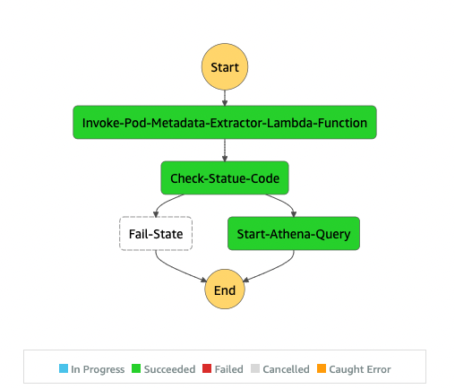
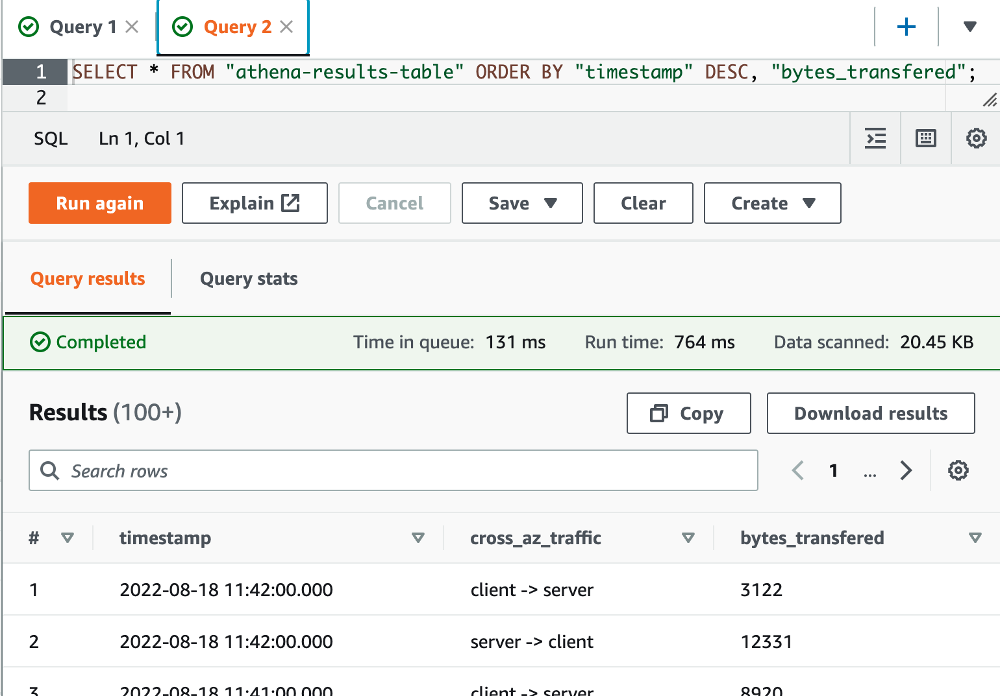

## Amazon EKS inter-az traffic visibility

The project implements an Amazon EKS Cross-AZ Pod to Pod network bytes visability
It is based on this blog: [Link to Blog]

## Solution overview

Our solution is based on 2 boilerplates:

* An Amazon VPC and an Amazon EKS cluster.
* A Python based AWS CDK stack which implements an AWS Lambda Function, Amazon Athena Tables & Queries, and all other required resources and configurations.

The following diagram depicts how the extract, transform, store and query process will occur.  
*(This flow represents an interactive console user which manually executes 1, 3, 4)*

1. The Pods Metadata Extractor lambda function connects to the EKS Cluster API endpoint.  
    *(It Authenticates and Authorised using a designated attached IAM Role mapped to a k8s RBAC identity).*  
     *We follow the least privilege paradigm allowing only the get and list API verbs.*
    
    The extracted data is then transformed and stored on an Amazon S3 bucket in CSV format.
2. [VPC Flow logs](https://docs.aws.amazon.com/vpc/latest/userguide/flow-logs.html) are enabled on the VPC level, records are aggregated and stored on an S3 Bucket.  
    *(This flow is a continues & in-depended of flow 1 above)*
3. Execution of the Athena named query joins both data sources.  
    The query then transforms and aggregates the enriched result, storing It in a [parquet](https://en.wikipedia.org/wiki/Apache_Parquet) format on an S3 Bucket.
4. Lastly, the user executes a simple **SELECT** query which returns the Cross-AZ Pod to Pod data records and their corresponding sum of transferred network bytes (**Egress**) column. 
    Results are displayed on-screen & saved into a designated S3 bucket.  

Amazon EventBridge uses a schedule rule (Hourly), executing a step function state machine workflow which will automate Steps 1 and 3, storing the results on a pre-created S3 Bucket.


Let's build...

## Walkthrough

The walkthrough consists of 3 main steps:

* Step 1: Deployment of the EKS Cluster
* Step 2: Deployment of the CDK Stack
* Step 3: Execution & Query (AWS Lambda and Amazon Athena queries)

### Prerequisites

* An AWS Account
* Shell environment with [AWS CLI](https://docs.aws.amazon.com/cli/latest/userguide/cli-chap-getting-started.html) Installed and Configured
* IAM Role with policy permissions, allowing to [deploy the EKS Cluster](https://docs.aws.amazon.com/eks/latest/userguide/getting-started-eksctl.html), and the CDK resources
* [Kubectl](https://docs.aws.amazon.com/eks/latest/userguide/install-kubectl.html)
* [Amazon EKS command line tool](https://docs.aws.amazon.com/eks/latest/userguide/eksctl.html) ([eksctl](https://eksctl.io/)), Installed and Configured
* AWS CDK and its dependencies (Provided at step 2)
* [Amazon Athena query results S3 Bucket](https://docs.aws.amazon.com/athena/latest/ug/querying.html#query-results-specify-location-console) (Interactive execution)

### Step 1: Deploy an EKS Cluster

#### **Set the environment**

```
aws configure set region us-east-2
export AWS_REGION=$(aws configure get region ) && echo "Your region was set to: $AWS_REGION"
```

#### **Generate the ClusterConfig**

```
cat >cluster.yaml <<EOF
apiVersion: eksctl.io/v1alpha5
kind: ClusterConfig
metadata:
  name: cross-az
  region: ${AWS_REGION}
nodeGroups:
  - name: ng-1
    desiredCapacity: 2
EOF
```

#### Deploy the Cluster

```
eksctl create cluster -f cluster.yaml
```

#### Get the Worker nodes, Pods and their topology zone data

```
kubectl get nodes --label-columns topology.kubernetes.io/zone
```

Example output:

```
NAME                                           STATUS   ROLES    AGE   VERSION               ZONE
ip-192-168-51-15.us-east-2.compute.internal    Ready    <none>   20m   v1.22.9-eks-810597c   us-east-2b
ip-192-168-64-199.us-east-2.compute.internal   Ready    <none>   20m   v1.22.9-eks-810597c   us-east-2a
```

#### Clone the application repo

```
cd ~
git clone https://gitlab.aws.dev/aws-israel-sa-scaling-team/cdk-eks-inner-az-observability
cd cdk-eks-inner-az-observability
```

#### Deploy the demo application

```
cd kubernetes/demoapp/
kubectl apply -f .
```

Explore the demoapp YAMLs, the application consists of a single Pod (http client) which runs a curl http loop on start. 
The target is a k8s service wired Into 2 nginx server pods (Endpoints).
The server-dep k8s deployment is implementing [pod topology spread constrains](https://kubernetes.io/docs/concepts/scheduling-eviction/topology-spread-constraints/), spreading the Pods across the distinct availability zones.

#### Validate the demo application

```
kubectl get deployment
```

Example output:

```
NAME         READY   UP-TO-DATE   AVAILABLE   AGE
client-dep   1/1     1            1           14s
server-dep   2/2     2            2           14s
```

#### Validate that the server Pods are spread across Nodes/AZs

```
kubectl get pods -l=app=server --sort-by="{.spec.nodeName}" -o wide
```

Example output:

```
NAME                         READY   STATUS    RESTARTS   AGE   IP               NODE                                           NOMINATED NODE   READINESS GATES
server-dep-797d7b54f-b9jf8   1/1     Running   0          61s   192.168.46.80    ip-192-168-51-15.us-east-2.compute.internal    <none>           <none>
server-dep-797d7b54f-8m6hx   1/1     Running   0          61s   192.168.89.235   ip-192-168-64-199.us-east-2.compute.internal   <none>           <none>
```

### Step 2: Deploy the CDK Stack

Create a Python virtual environment and install the dependencies

```
cd ~/cdk-eks-inner-az-observability
python3 -m venv .venv
source .venv/bin/activate
./scripts/install-deps.sh
```

Our CDK Stack requires the VPCID and the eks CLUSTERNAME

```
export CLUSTERNAME="cross-az"
export VPCID=$(aws eks describe-cluster --name $CLUSTERNAME --query cluster.resourcesVpcConfig.vpcId | sed -e 's/^"//' -e 's/"$//')
echo $CLUSTERNAME;echo $VPCID
```

#### Deploy the stack

```
cdk bootstrap
npx cdk deploy CdkEksInterAzVisibility --parameters eksClusterName=$CLUSTERNAME --parameters eksVpcId=$VPCID
```

#### Authorise the Lambda function (k8s client)

Lets get the **Pod Metadata Extractor** **IAM Role** 
*(Used by the Lambda function to authenticate and authorise when connecting to the EKS Cluster API)*

```
export POD_METADATA_EXTRACTOR_IAM_ROLE=$(aws cloudformation describe-stacks --stack-name "CdkEksInterAzVisibility" --output json --query "Stacks[0].Outputs[0].OutputValue" | sed -e 's/^"//' -e 's/"$//')
echo $POD_METADATA_EXTRACTOR_IAM_ROLE
```

Create a ClusterRole and binding for the **Pod Metadata Extractor** Lambda Function

```
kubectl apply -f kubernetes/pod-metadata-extractor-clusterrole.yaml
```

#### Append a role mapping to `ConfigMap/aws-auth`

>⚠ **We recommend using eksctl, or another tool, to edit the ConfigMap. For information about other tools you can use, see [Use tools](https://aws.github.io/aws-eks-best-practices/security/docs/iam/#use-tools-to-make-changes-to-the-aws-auth-configmap) to make changes to the aws-authConfigMap in the Amazon EKS best practices guides. An improperly formatted aws-auth ConfigMap can cause you to lose access to your cluster**

```
eksctl create iamidentitymapping \
--cluster ${CLUSTERNAME} \
--arn ${POD_METADATA_EXTRACTOR_IAM_ROLE} \
--username "eks-inter-az-visibility-binding" \
--group "eks-inter-az-visibility-group"
```

#### Validate

```
eksctl get iamidentitymapping --cluster ${CLUSTERNAME}
```

Expected output:

```
ARN                                                                                             USERNAME                                GROUPS                                  ACCOUNT
arn:aws:iam::555555555555:role/eksctl-cross-az-nodegroup-ng-1-NodeInstanceRole-IPHG3L5AXR3      system:node:{{EC2PrivateDNSName}}       system:bootstrappers,system:nodes
arn:aws:iam::555555555555:role/pod-metadata-extractor-role                                      eks-inter-az-visibility-binding         eks-inter-az-visibility-group
```

### Step 3: Execute, Query and Watch results

The step functions workflow will execute the lambda function and if successful, shall execute the Athena named query.

For the purpose of the walkthrough we will force a manual execution, interactively.  
Head over to the AWS Console Step Functions area and:  

* Click the "**pod-metadata-extractor-orchestrator**" state machine
* On the "Execution pane", click the "**Start execution**", accept defaults and click "**Start execution**"
* After few seconds the "**Graph inspector**" should look like this:



* Inspect the output result stored on the CDK pre-created S3 Bucket.  
*(You can get the bucket name by Inspecting the “*Definition*” tab of the "pod-metadata-extractor-orchestrator" *state machine*)*. 

See an example output:

```
"ResultConfiguration": {
"OutputLocation": "s3://cdkeksinterazvisibility-athenaanalyzerathenaresul-4444444444444/query_results/"
```

The Step function allows you to implement a batch process workflow which can be used to query the result and visualise or analyse It for many purposes. In the next section we shall execute the entire process manually and interactively in order the view the query results on the Athena console.


#### Viewing the process and results Interactively

* Head over to the Amazon Athena section.  
*(Query results bucket should have been set, see Prerequisites section. This should be a transient In-Region S3 bucket for the purpose of viewing the results, interactively)*. 

* On the Athena query pane, Start a new query (+ Sign) and execute/run the below query:

```
SELECT * FROM "athena-results-table" ORDER BY "timestamp" DESC, "bytes_transfered";
```

Expected output:



Examine the results!

## Considerations

* Cost: While the blueprints use minimal resources, deploying those blueprints will incur cost.
* The Pods Metadata Extractor Lambda function will get all Pods (labeled: “app”) across all namespaces.  
This will add extra load on the API Servers. Enable & Observe [control plane Metrics](https://aws.github.io/aws-eks-best-practices/reliability/docs/controlplane/#monitor-control-plane-metrics), optimise at which interval/time the function shall be executed.
* In large scale busy clusters consider on scoping the function to get Pods in a specific namespace(s)
* In EKS clusters where Pod churn is high, results may be inconsistent, In this use-case consider to schedule the Amazon EventBridge rule more frequently 
* The solution **was not designed** to be used as a chargeback **nor for any billing purposes**

## Conclusion

In this post, We have build a solution which provides a Cross-AZ Pod to Pod network bytes visibility inside an Amazon EKS Clusters using the AWS VPC CNI Plug-in.
I wanted to share that prior on building It we spoke to many AWS customers. 
One of the core design tenets we followed (As a result of the feedback) is to introduce a solution which does not require the customers to deploy any operational k8s constructs.   
Those constructs (DaemonSets/Deployments) often mandates privileged access to the underlying nodes and their network namespace.  
We cannot wait to see how will the community improve/extend this solution, did I mentiond that we are open to review pull requests? [Kobi, Link to repo]

## Cleanup

### Destroy the CDK Stack

```
source .venv/bin/activate
cd ~/cdk-eks-inner-az-observability
npx cdk destroy CdkEksInterAzVisibility
aws cloudformation delete-stack --stack-name CDKToolkit
```

### Destroy the EKS cluster

```
eksctl delete cluster --name=${CLUSTERNAME}
```


## Security

See [CONTRIBUTING](CONTRIBUTING.md#security-issue-notifications) for more information.

## License

This library is licensed under the MIT-0 License. See the LICENSE file.

